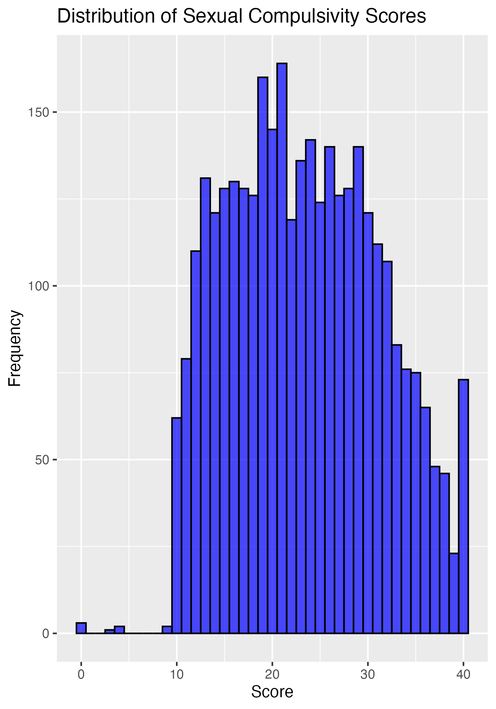

# Sexual Compulsivity Scale Data Analysis
## Project Overview 
This project explores open-source data from the Sexual Compulsivity Scale (SCS), developed by Kalichman and Rompa (1995). The SCS is a psychological measure designed to assess the extent of sexual compulsivity in individuals. The data used in this analysis comes from an online dataset provided by www.OpenPsychometrics.org, which includes answers to the SCS from individuals who volunteered to participate in the survey. The data includes the results of 10 items from the scale, as well as demographic information such as gender and age.
## Dataset 
The dataset contains the following columns:
- **Q1 - Q10**: Responses to the 10 items on the Sexual Compulsivity Scale, rated on a Likert scale (1 = Not at all like me, 4 = Very much like me).
- **score**: The total score for each individual, which is the sum of all 10 responses.
- **gender**: The gender of the respondent (1 = Male, 2 = Female, 3 = Other, 0 = Not Answered).
- **age**: The age of the respondent.

Data was filtered to include only those who indicated that their responses were accurate and suitable for research (79% of total respondents).

## Objectives
The goal of this project is to practice exploring data and understanding key patterns, trends, and relationships within the responses. Specific objectives include:
- Conducting **exploratory data analysis (EDA)** to understand the distribution of the scores and identify any patterns in the data.
- Examining potential **gender differences** in sexual compulsivity.
- Investigating whether there is any correlation between **age** and sexual compulsivity scores.

## Key Analyses

- **Distribution of Scores**: I created histograms to visualize the distribution of sexual compulsivity scores.
- **Gender Differences**: A t-test was performed to compare the scores between males and females.
  
### T-test Results
- **t-statistic**: -0.61908
- **p-value**: 0.5359
- **95% Confidence Interval**: [-0.77, 0.40]
- **Conclusion**: No statistically significant difference was found between male and female scores (p > 0.05).

## Visualizations

- **Histogram of Sexual Compulsivity Scores**  
  

- **Boxplot of Sexual Compulsivity Scores by Gender**  
  

## Code

You can find the full analysis code in the `analysis.R` file.

## Data Source

The data used in this project comes from the [Sexual Compulsivity Scale dataset](https://openpsychometrics.org/_rawdata/).
