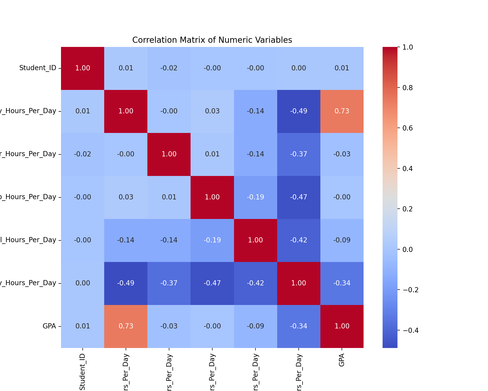
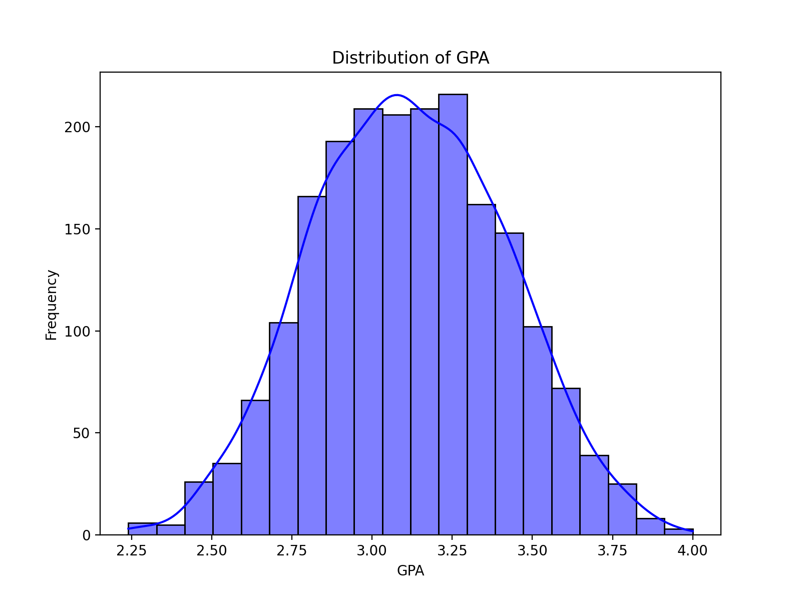
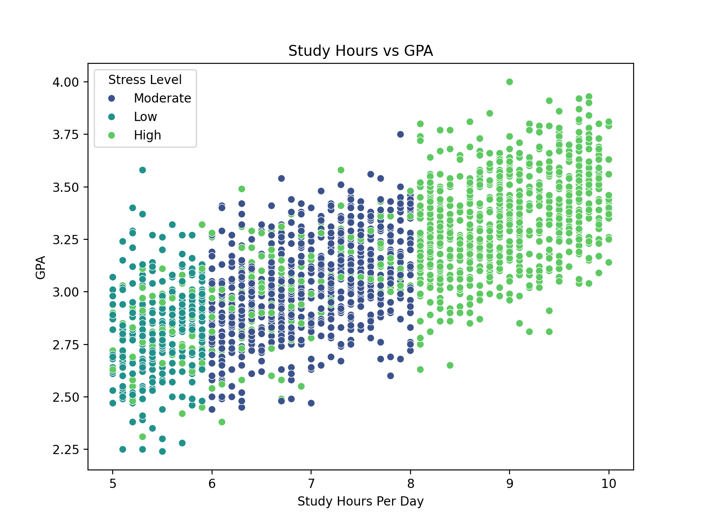
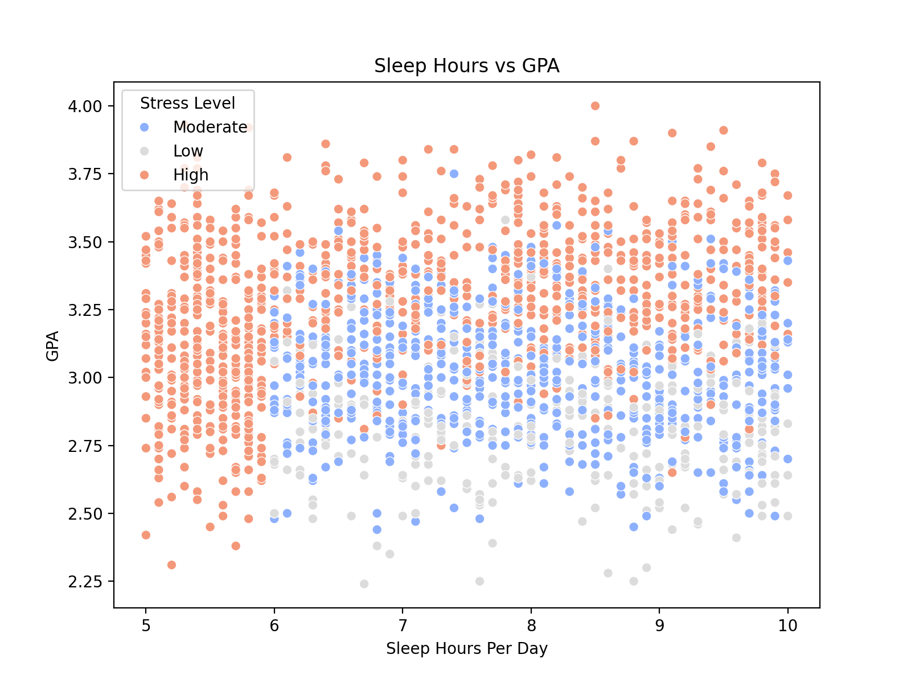
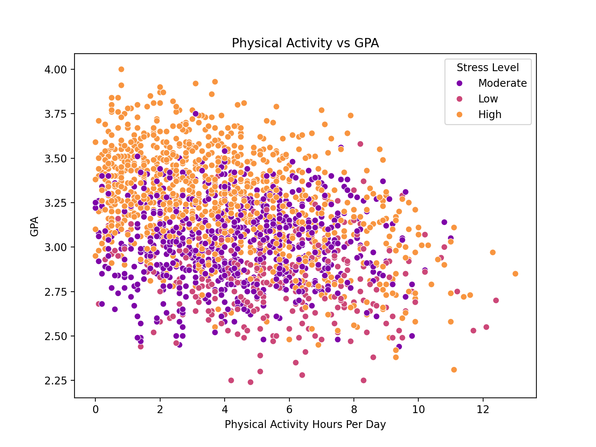
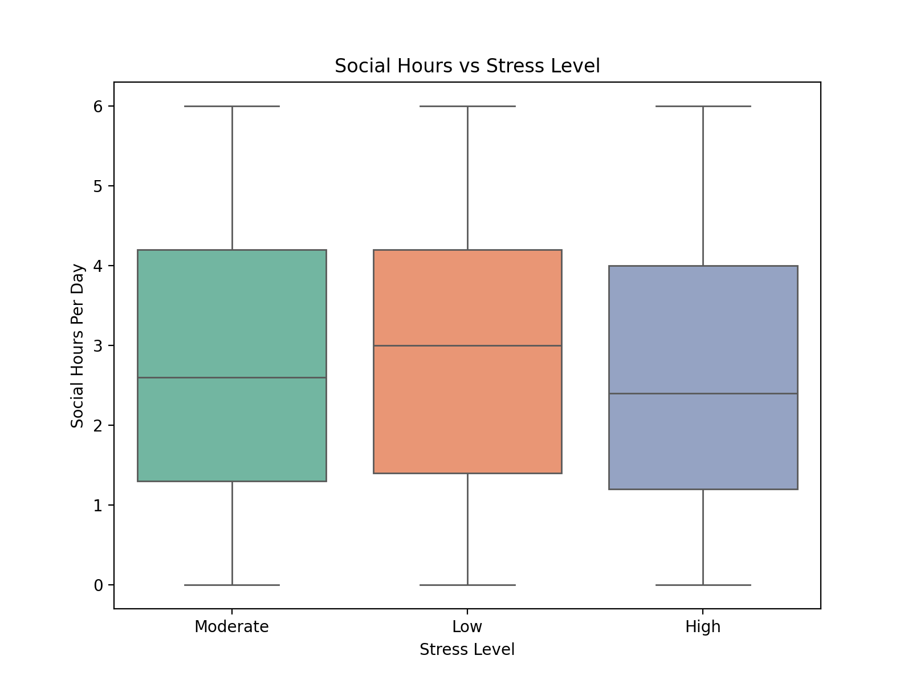

# Student Lifestyle and Academic Performance Analysis

This project analyzes the relationship between student lifestyle factors (e.g., study hours, sleep, physical activity) and academic performance (GPA) using a dataset of 2000 students. The data used in this analysis comes from an online dataset provided by www.OpenPsychometrics.org.

## Dataset
The dataset contains the following columns:
- **Student_ID**: Unique identifier for each student.
- **Study_Hours_Per_Day**: Average hours spent studying daily.
- **Extracurricular_Hours_Per_Day**: Average hours spent on extracurricular activities daily.
- **Sleep_Hours_Per_Day**: Average hours of sleep daily.
- **Social_Hours_Per_Day**: Average hours spent on social activities daily.
- **Physical_Activity_Hours_Per_Day**: Average hours spent on physical activities daily.
- **GPA**: Grade Point Average of the student.
- **Stress_Level**: Categorical variable indicating the stress level (Low, Moderate, High).

## Key Findings
1. **Study Hours and GPA**: A strong positive correlation exists, indicating that more study hours lead to higher GPAs.
2. **Sleep Hours and GPA**: Weak correlation, suggesting sleep has a limited direct impact on GPA.
3. **Physical Activity and GPA**: Moderate negative correlation, with excessive physical activity slightly lowering GPA.
4. **Social Hours and Stress Levels**: Higher stress levels are associated with fewer social hours.

## Visualizations
The following visualizations were generated:

### 1. Correlation Matrix

### 2. Distribution of GPA

### 3. Study Hours vs GPA

### 4. Sleep Hours vs GPA

### 5. Physical Activity vs GPA

### 6. Social Hours vs Stress Level

